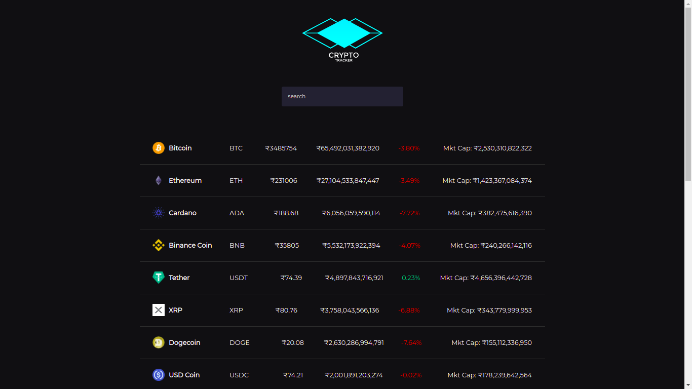

# 💰 Crypto Finance Tracker Project 💰

   

`This Project(Frontend application) is build using NextJS. This web application provide the current prices, market values and percentage of crypto currency.`

### For API : [!API](https://www.coingecko.com/en/api/documentation)

## 👀 Sneak-peak 👀

## See Deployment

